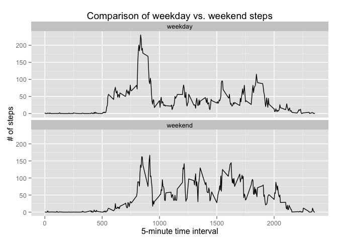

# Reproducible Research: Peer Assessment 1


## Loading and preprocessing the data


```r
setwd("~/datasciencecoursera/05_Reproducible_Research/RepData_PeerAssessment1")
data <- read.csv("activity.csv")
data.rmNA <- data[ !is.na(data$steps), ]
```

## What is mean total number of steps taken per day?

```r
#http://stackoverflow.com/questions/16296657/row-aggregation-according-to-date-in-r-and-sum-corresponding-other-column-values
bydate <- aggregate( data.rmNA$steps, by = list(data.rmNA$date), FUN = "sum")
names(bydate) = c( "date", "steps")
hist(bydate$steps)
```

 

```r
summarize <- summary(bydate$steps)
summarize["Mean"]
```

```
##  Mean 
## 10770
```

```r
summarize["Median"]
```

```
## Median 
##  10760
```


## What is the average daily activity pattern?


```r
byinterval <- aggregate( data.rmNA$steps, by = list(data.rmNA$interval), FUN = "mean")
names(byinterval) <- c("interval","steps")
plot(byinterval$interval, byinterval$steps, type = "l")
```

 

```r
maxintervalindex <- which.max(byinterval$steps)
byinterval[maxintervalindex,]
```

```
##     interval    steps
## 104      835 206.1698
```


## Imputing missing values

Total number of missing values in the dataset (i.e. the total number of rows with NAs; NAs are only in the steps column)

```r
sum( is.na(data$steps) )
```

```
## [1] 2304
```

```r
imputed <- data
for (i in 1:nrow(imputed)) { # iterate over every row of the copied dataset
    if ( is.na(imputed[i,]$steps) ) { # if the number of steps for that row is NA...
        interval <- imputed[i,]$interval # figure out what the interval is for that row...
        imputed[i,]$steps <- byinterval[ byinterval$interval == interval, ]$steps # fill in mean # of steps for that interval
    }
}
bydate <- aggregate( imputed$steps, by = list(imputed$date), FUN = "sum")
names(bydate) = c( "date", "steps")
hist(bydate$steps)
```

 

```r
summarize <- summary(bydate$steps)
summarize["Mean"]
```

```
##  Mean 
## 10770
```

```r
summarize["Median"]
```

```
## Median 
##  10770
```


## Are there differences in activity patterns between weekdays and weekends?


```r
library(car) # from http://stackoverflow.com/questions/14841468/how-to-create-a-new-factor-based-on-a-current-factor
imputed$date <- as.Date(imputed$date)
imputed$dayofweek = as.factor( weekdays(imputed$date) )
imputed$weekfactor <- recode( imputed$dayofweek, "c('Friday','Monday','Thursday','Tuesday','Wednesday') = 'weekday';
                              c('Saturday','Sunday') = 'weekend' ")

byinterval <- aggregate( imputed$steps, by = list(imputed$interval, imputed$weekfactor), FUN = "mean")
names(byinterval) <- c("interval","weekfactor","steps")

library(ggplot2)
g <- ggplot( byinterval, aes(interval, steps, group = weekfactor) )
g + geom_line() + facet_wrap( ~ weekfactor, ncol = 1 )
```

 

